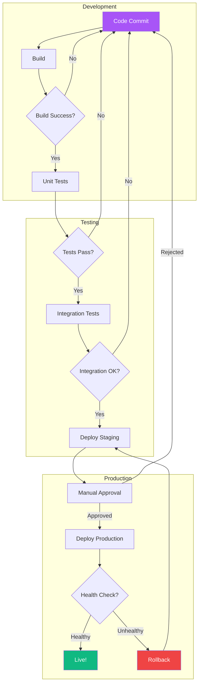
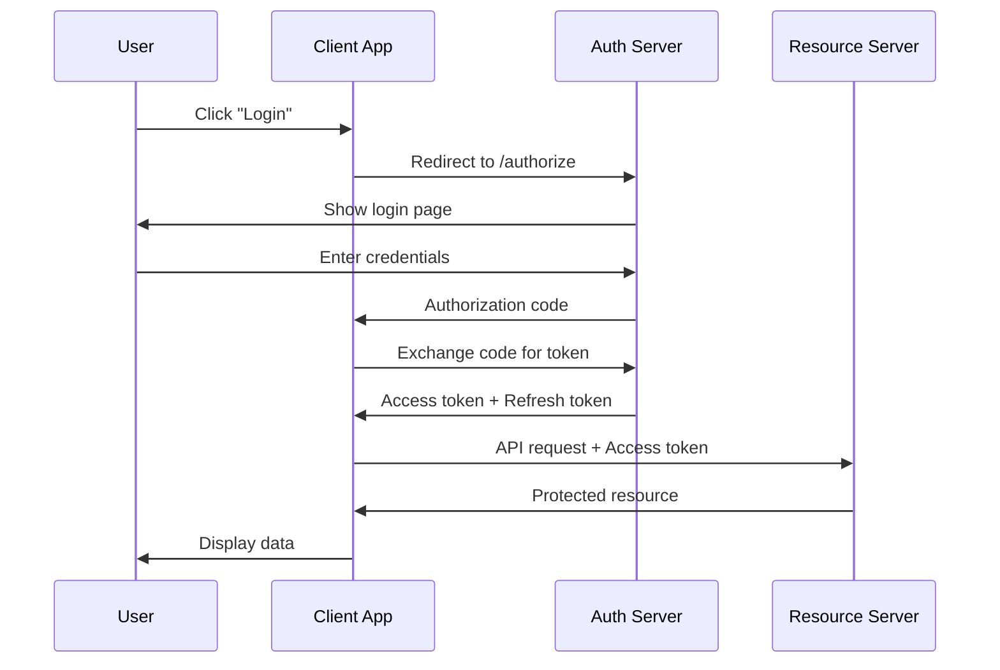

# Executive Guide: Dynamic Visual Procedures

```
╔══════════════════════════════════════════════════════════════════════╗
║                                                                      ║
║     DYNAMIC VISUALS EXECUTIVE GUIDE                                  ║
║     SVG Flows | Mermaid Diagrams | D3.js | CSS Animations           ║
║                                                                      ║
║     For Gemini Nano Bana Prompt Engineering                          ║
║                                                                      ║
╚══════════════════════════════════════════════════════════════════════╝
```

---

## Table of Contents

1. [Overview](#overview)
2. [SVG Animation Procedures](#1-svg-animation-procedures)
3. [Mermaid Diagram Flows](#2-mermaid-diagram-flows)
4. [D3.js Visualization Techniques](#3-d3js-visualization-techniques)
5. [CSS Animation Techniques](#4-css-animation-techniques)
6. [Interactive HTML Procedures](#5-interactive-html-procedures)
7. [LinkedIn-Style Animated Diagrams](#6-linkedin-style-animated-diagrams)
8. [Prompt Templates for Each Technology](#7-prompt-templates)
9. [Best Practices](#8-best-practices)

---

## Overview

This guide covers how to use Gemini Nano Bana to generate dynamic visual content including animated SVGs, flowcharts, data visualizations, and interactive diagrams. Each section includes the prompt to use, the expected code output, and how the technology works.

```
TECHNOLOGY STACK:
┌─────────────┐   ┌─────────────┐   ┌─────────────┐   ┌─────────────┐
│    SVG       │   │  Mermaid.js │   │   D3.js     │   │ CSS Anim    │
│  Animations  │   │  Diagrams   │   │  Data Viz   │   │  Keyframes  │
│             │   │             │   │             │   │             │
│ stroke-dash │   │ graph TD    │   │ selections  │   │ @keyframes  │
│ animateMotn │   │ flowchart   │   │ scales      │   │ transitions │
│ <animate>   │   │ sequence    │   │ axes        │   │ transforms  │
└─────────────┘   └─────────────┘   └─────────────┘   └─────────────┘
     ↓                  ↓                  ↓                  ↓
     └──────────────────┴──────────────────┴──────────────────┘
                    ALL GENERATED VIA PROMPTS
```

---

## 1. SVG Animation Procedures

### How SVG Line Animation Works

The key technique for flowing/moving lines in SVG uses two properties:

```
stroke-dasharray:  Controls the pattern of dashes and gaps
stroke-dashoffset: Controls where the dash pattern starts

VISUAL:
stroke-dasharray: 10 5
──── ──── ──── ──── ────

stroke-dashoffset: 0 → full visible
stroke-dashoffset: 100 → shifted (appears to move)

ANIMATION: Transition dashoffset from length → 0
Result: Line appears to "draw itself"
```

### Prompt to Generate SVG Animations

```
Generate an SVG animation that shows a flowchart with lines that
draw themselves. Use stroke-dasharray and stroke-dashoffset CSS
animations. The flowchart should show: Start → Process → Decision
→ End. Each line should animate sequentially with a 0.5s delay.
Include the complete HTML file with embedded SVG and CSS.
```

### Expected Code Output

```html
<svg width="600" height="400" xmlns="http://www.w3.org/2000/svg">
  <defs>
    <linearGradient id="lineGrad" x1="0%" y1="0%" x2="100%" y2="0%">
      <stop offset="0%" style="stop-color:#a855f7"/>
      <stop offset="100%" style="stop-color:#06b6d4"/>
    </linearGradient>
  </defs>

  <style>
    .flow-line {
      stroke: url(#lineGrad);
      stroke-width: 3;
      fill: none;
      stroke-dasharray: 200;
      stroke-dashoffset: 200;
      animation: drawLine 1.5s ease forwards;
    }
    .flow-line:nth-child(2) { animation-delay: 0.5s; }
    .flow-line:nth-child(3) { animation-delay: 1.0s; }

    @keyframes drawLine {
      to { stroke-dashoffset: 0; }
    }

    .node {
      opacity: 0;
      animation: fadeIn 0.5s ease forwards;
    }
    .node:nth-child(1) { animation-delay: 0s; }
    .node:nth-child(2) { animation-delay: 0.5s; }
    .node:nth-child(3) { animation-delay: 1.0s; }

    @keyframes fadeIn {
      to { opacity: 1; }
    }
  </style>

  <!-- Nodes -->
  <rect class="node" x="50" y="50" width="120" height="50" rx="10"
        fill="#a855f7" opacity="0"/>
  <text x="110" y="80" text-anchor="middle" fill="white">Start</text>

  <!-- Animated Lines -->
  <line class="flow-line" x1="170" y1="75" x2="280" y2="75"/>
  <line class="flow-line" x1="400" y1="75" x2="510" y2="75"/>
</svg>
```

### SVG `<animate>` Element Method

```html
<!-- Alternative: Using SVG's built-in <animate> element -->
<path d="M 50,200 C 150,100 250,300 350,200" fill="none"
      stroke="#a855f7" stroke-width="3"
      stroke-dasharray="500" stroke-dashoffset="500">
  <animate attributeName="stroke-dashoffset"
           from="500" to="0" dur="2s"
           fill="freeze" repeatCount="1"/>
</path>
```

### SVG `<animateMotion>` for Moving Objects

```html
<!-- Make an object follow a path -->
<circle r="5" fill="#06b6d4">
  <animateMotion dur="3s" repeatCount="indefinite">
    <mpath href="#flowPath"/>
  </animateMotion>
</circle>

<path id="flowPath" d="M 50,200 C 150,100 250,300 350,200"
      fill="none" stroke="#333" stroke-width="1"/>
```

---

## 2. Mermaid Diagram Flows

### What is Mermaid.js?

Mermaid is a JavaScript-based diagramming tool that renders text definitions into diagrams. It's supported natively in GitHub markdown, Notion, and many documentation tools.

### Prompt to Generate Mermaid Diagrams

```
Create a Mermaid.js flowchart showing a CI/CD pipeline with these stages:
Code Commit → Build → Unit Tests → Integration Tests → Deploy Staging →
Approval Gate → Deploy Production. Include error paths that loop back
to relevant stages. Use subgraphs to group related stages.
```

### Expected Mermaid Code Output



### Mermaid Diagram Types Reference

```
AVAILABLE DIAGRAM TYPES:
┌──────────────────┬────────────────────────────────────┐
│ Type             │ Mermaid Syntax                     │
├──────────────────┼────────────────────────────────────┤
│ Flowchart        │ graph TD / graph LR                │
│ Sequence         │ sequenceDiagram                    │
│ Class Diagram    │ classDiagram                       │
│ State Diagram    │ stateDiagram-v2                    │
│ ER Diagram       │ erDiagram                          │
│ Gantt Chart      │ gantt                              │
│ Pie Chart        │ pie                                │
│ Git Graph        │ gitGraph                           │
│ Mind Map         │ mindmap                            │
│ Timeline         │ timeline                           │
└──────────────────┴────────────────────────────────────┘
```

### Sequence Diagram Example

```
Generate a Mermaid sequence diagram showing OAuth2 authentication flow
between User, Client App, Auth Server, and Resource Server.
```



---

## 3. D3.js Visualization Techniques

### What is D3.js?

D3 (Data-Driven Documents) is a JavaScript library for creating dynamic, interactive data visualizations in the browser using SVG, HTML, and CSS.

### Prompt to Generate D3.js Visualizations

```
Create a D3.js force-directed graph showing a network of 10
interconnected microservices. Each node represents a service,
edges represent API calls. Node size = request volume,
edge thickness = call frequency. Include hover tooltips
showing service name and health status. Use a dark theme.
```

### Expected D3.js Code Output

```html
<!DOCTYPE html>
<html>
<head>
<style>
  body { background: #0a0a1a; margin: 0; overflow: hidden; }
  .tooltip {
    position: absolute;
    background: rgba(10,10,26,0.9);
    border: 1px solid #a855f7;
    border-radius: 8px;
    padding: 10px;
    color: white;
    font-family: monospace;
    pointer-events: none;
  }
</style>
</head>
<body>
<script src="https://d3js.org/d3.v7.min.js"></script>
<script>
const width = window.innerWidth;
const height = window.innerHeight;

const nodes = [
  { id: "API Gateway", group: 1, size: 30, health: "healthy" },
  { id: "Auth Service", group: 1, size: 20, health: "healthy" },
  { id: "User Service", group: 2, size: 25, health: "warning" },
  { id: "Order Service", group: 2, size: 22, health: "healthy" },
  { id: "Payment Service", group: 3, size: 18, health: "healthy" },
  { id: "Inventory", group: 3, size: 15, health: "critical" },
  { id: "Notification", group: 4, size: 12, health: "healthy" },
  { id: "Analytics", group: 4, size: 10, health: "healthy" },
  { id: "Cache Layer", group: 1, size: 20, health: "healthy" },
  { id: "Database", group: 5, size: 28, health: "healthy" }
];

const links = [
  { source: "API Gateway", target: "Auth Service", value: 5 },
  { source: "API Gateway", target: "User Service", value: 8 },
  { source: "API Gateway", target: "Order Service", value: 7 },
  { source: "Order Service", target: "Payment Service", value: 6 },
  { source: "Order Service", target: "Inventory", value: 4 },
  { source: "User Service", target: "Database", value: 9 },
  { source: "Auth Service", target: "Cache Layer", value: 5 },
  { source: "Payment Service", target: "Notification", value: 3 },
  { source: "Analytics", target: "Database", value: 6 },
  { source: "Cache Layer", target: "Database", value: 7 }
];

const colorScale = d3.scaleOrdinal()
  .domain([1, 2, 3, 4, 5])
  .range(["#a855f7", "#06b6d4", "#ec4899", "#f97316", "#10b981"]);

const svg = d3.select("body").append("svg")
  .attr("width", width)
  .attr("height", height);

const simulation = d3.forceSimulation(nodes)
  .force("link", d3.forceLink(links).id(d => d.id).distance(120))
  .force("charge", d3.forceManyBody().strength(-300))
  .force("center", d3.forceCenter(width / 2, height / 2));

const link = svg.append("g")
  .selectAll("line")
  .data(links)
  .join("line")
  .attr("stroke", "#ffffff30")
  .attr("stroke-width", d => d.value / 2);

const node = svg.append("g")
  .selectAll("circle")
  .data(nodes)
  .join("circle")
  .attr("r", d => d.size)
  .attr("fill", d => colorScale(d.group))
  .attr("stroke", "#fff")
  .attr("stroke-width", 1.5)
  .call(d3.drag()
    .on("start", dragstarted)
    .on("drag", dragged)
    .on("end", dragended));

simulation.on("tick", () => {
  link
    .attr("x1", d => d.source.x)
    .attr("y1", d => d.source.y)
    .attr("x2", d => d.target.x)
    .attr("y2", d => d.target.y);
  node
    .attr("cx", d => d.x)
    .attr("cy", d => d.y);
});

function dragstarted(event, d) {
  if (!event.active) simulation.alphaTarget(0.3).restart();
  d.fx = d.x; d.fy = d.y;
}
function dragged(event, d) { d.fx = event.x; d.fy = event.y; }
function dragended(event, d) {
  if (!event.active) simulation.alphaTarget(0);
  d.fx = null; d.fy = null;
}
</script>
</body>
</html>
```

### D3.js Visualization Types Reference

```
D3.js CHART TYPES FOR NANO BANA PROMPTS:
┌─────────────────────┬─────────────────────────────────────┐
│ Visualization       │ Best Prompt Use Case                │
├─────────────────────┼─────────────────────────────────────┤
│ Force Graph         │ Network relationships, dependencies │
│ Bar Chart           │ Categorical comparisons             │
│ Line Chart          │ Time series, trends                 │
│ Treemap             │ Hierarchical data, proportions      │
│ Sunburst            │ Nested categories with sizes        │
│ Sankey Diagram      │ Flow quantities between stages      │
│ Chord Diagram       │ Bidirectional relationships         │
│ Geographic Map      │ Location-based data                 │
│ Heatmap             │ Density, correlation matrices       │
│ Bubble Chart        │ 3-variable comparison               │
└─────────────────────┴─────────────────────────────────────┘
```

---

## 4. CSS Animation Techniques

### Core CSS Animation Properties

```css
/* The two main approaches */

/* 1. CSS Transitions - Simple state changes */
.element {
  transition: transform 0.3s ease, opacity 0.5s ease;
}
.element:hover {
  transform: scale(1.1);
  opacity: 0.8;
}

/* 2. CSS Keyframe Animations - Complex sequences */
@keyframes pulse {
  0%   { transform: scale(1); opacity: 1; }
  50%  { transform: scale(1.05); opacity: 0.8; }
  100% { transform: scale(1); opacity: 1; }
}
.element {
  animation: pulse 2s ease-in-out infinite;
}
```

### Flowing Line Animation (LinkedIn-Style)

```css
/* THE SECRET: stroke-dasharray + stroke-dashoffset */

.flowing-line {
  stroke-dasharray: 10 5;           /* 10px dash, 5px gap */
  animation: flow 2s linear infinite;
}

@keyframes flow {
  to {
    stroke-dashoffset: -30;          /* Move the pattern */
  }
}

/* Gradient flowing effect */
.gradient-flow {
  stroke: url(#animatedGradient);
  stroke-dasharray: 200;
  stroke-dashoffset: 200;
  animation: drawLine 2s ease forwards;
}

@keyframes drawLine {
  to { stroke-dashoffset: 0; }      /* Line draws itself */
}
```

### Pulsing Node Animation

```css
.node-pulse {
  animation: nodePulse 2s ease-in-out infinite;
}

@keyframes nodePulse {
  0%, 100% {
    r: 20;                           /* SVG radius */
    filter: drop-shadow(0 0 5px #a855f7);
  }
  50% {
    r: 24;
    filter: drop-shadow(0 0 15px #a855f7);
  }
}
```

---

## 5. Interactive HTML Procedures

### Prompt for Interactive Diagrams

```
Create an interactive HTML page where:
- Users can click on nodes to expand/collapse details
- Hovering shows tooltips with descriptions
- Clicking a path highlights the full route
- Nodes can be dragged to rearrange
Use vanilla JavaScript (no frameworks).
Dark theme with purple/teal gradient accents.
```

### Interactive Click-to-Expand Example

```html
<div class="node" onclick="toggleDetails(this)">
  <div class="node-header">API Gateway</div>
  <div class="node-details" style="display:none">
    <p>Routes: /api/v1/*, /api/v2/*</p>
    <p>Rate Limit: 1000 req/min</p>
    <p>Auth: JWT Bearer Token</p>
  </div>
</div>

<script>
function toggleDetails(node) {
  const details = node.querySelector('.node-details');
  const isVisible = details.style.display !== 'none';
  details.style.display = isVisible ? 'none' : 'block';
  node.classList.toggle('expanded');
}
</script>

<style>
.node {
  background: linear-gradient(135deg, #1a1a2e, #16213e);
  border: 1px solid #a855f7;
  border-radius: 12px;
  padding: 16px;
  cursor: pointer;
  transition: all 0.3s ease;
}
.node:hover {
  border-color: #06b6d4;
  box-shadow: 0 0 20px rgba(168,85,247,0.3);
}
.node.expanded {
  border-color: #10b981;
  transform: scale(1.02);
}
</style>
```

---

## 6. LinkedIn-Style Animated Diagrams

### How LinkedIn Animated Posts Work

LinkedIn animated diagrams typically use:

```
TECHNIQUE STACK:
1. SVG for vector graphics (scalable, crisp)
2. CSS @keyframes for animations
3. stroke-dasharray for line flow effects
4. Gradient definitions for color transitions
5. opacity animations for fade-in sequences

TIMING:
- Staggered delays create "building" effect
- Each element appears 0.3-0.5s after the previous
- Lines animate BETWEEN node appearances
- Total animation: 3-5 seconds for full reveal

FORMAT:
- Usually exported as GIF or MP4 for LinkedIn
- Can also be embedded as HTML in web articles
- Tools: Figma + Lottie, After Effects, or pure CSS
```

### See the `linkedin_special/` folder for 6 complete runnable examples:

1. **AI Roadmap** - Animated learning path with flowing connections
2. **Tech Stack Flow** - Request journey through system layers
3. **Career Growth** - Progressive skill development roadmap
4. **DevOps Pipeline** - CI/CD flow with animated data particles
5. **API Architecture** - Microservices communication flow
6. **Data Pipeline** - ETL process with streaming animations

---

## 7. Prompt Templates

### Template: SVG Animation

```
Generate a complete HTML file with an animated SVG diagram showing
[TOPIC]. Requirements:
- Dark background (#0a0a1a)
- Use gradient colors (purple #a855f7 to teal #06b6d4)
- Lines should animate using stroke-dasharray/dashoffset
- Nodes should fade in with staggered delays
- Include pulsing glow effects on key nodes
- Total animation duration: [X] seconds
- Size: [WIDTH]x[HEIGHT] pixels
```

### Template: Mermaid Diagram

```
Create a Mermaid.js [DIAGRAM_TYPE] diagram showing [TOPIC].
Include:
- [N] main nodes/stages
- Decision points with Yes/No paths
- Error/fallback paths
- Subgraphs to group related items
- Custom styling with colors
Output the Mermaid code block only.
```

### Template: D3.js Visualization

```
Generate a D3.js [CHART_TYPE] visualization for this data:
[DATA]
Requirements:
- Dark theme (background: #0a0a1a)
- Color palette: [COLORS]
- Interactive: hover tooltips, click to highlight
- Responsive to window size
- Include axis labels and legend
- Smooth transitions on data changes
Output as a complete HTML file with embedded D3.js.
```

### Template: Interactive HTML

```
Create an interactive HTML diagram showing [TOPIC].
Features:
- Click nodes to expand details
- Hover for tooltips
- Drag to rearrange (optional)
- Animated connections between nodes
- Search/filter functionality (optional)
- Dark theme with [COLOR] accents
No external dependencies (vanilla JS only).
```

---

## 8. Best Practices

### DO's

```
✅ Keep animations subtle (2-3 seconds max for loops)
✅ Use easing functions (ease-in-out, cubic-bezier)
✅ Stagger element appearances for visual flow
✅ Use gradients sparingly for accent, not everywhere
✅ Test on multiple screen sizes
✅ Provide static fallback for accessibility
✅ Use semantic SVG elements (<title>, <desc>)
✅ Optimize SVG paths (remove unnecessary points)
```

### DON'Ts

```
❌ Don't make everything animate simultaneously
❌ Don't use more than 3-4 colors in one diagram
❌ Don't create animations longer than 5 seconds
❌ Don't forget reduced-motion media queries
❌ Don't use heavy JavaScript when CSS suffices
❌ Don't make text smaller than 12px in diagrams
```

### Accessibility

```css
/* Always include reduced motion support */
@media (prefers-reduced-motion: reduce) {
  * {
    animation-duration: 0.01ms !important;
    animation-iteration-count: 1 !important;
    transition-duration: 0.01ms !important;
  }
}
```

### Performance Tips

```
OPTIMIZATION CHECKLIST:
┌─────────────────────────────────────────────────────────────┐
│ 1. Use CSS animations over JavaScript when possible         │
│ 2. Animate transform/opacity (GPU-accelerated)              │
│ 3. Avoid animating width/height/top/left                    │
│ 4. Use will-change for known animated properties            │
│ 5. Limit concurrent animations to < 20 elements            │
│ 6. Use requestAnimationFrame for JS animations              │
│ 7. Debounce resize handlers for responsive charts           │
└─────────────────────────────────────────────────────────────┘
```

---

## Quick Reference Card

```
TECHNOLOGY SELECTION GUIDE:
┌─────────────────┬──────────────┬──────────────┬──────────────┐
│ Need            │ Best Tool    │ Complexity   │ Interactivity│
├─────────────────┼──────────────┼──────────────┼──────────────┤
│ Simple flowchart│ Mermaid.js   │ Low          │ None         │
│ Animated flow   │ SVG + CSS    │ Medium       │ Low          │
│ Data dashboard  │ D3.js        │ High         │ High         │
│ Interactive map │ D3.js + SVG  │ High         │ High         │
│ LinkedIn post   │ SVG + CSS    │ Medium       │ None (GIF)   │
│ Documentation   │ Mermaid.js   │ Low          │ None         │
│ Presentation    │ SVG + CSS    │ Medium       │ Low          │
│ Real-time data  │ D3.js        │ High         │ High         │
└─────────────────┴──────────────┴──────────────┴──────────────┘
```
